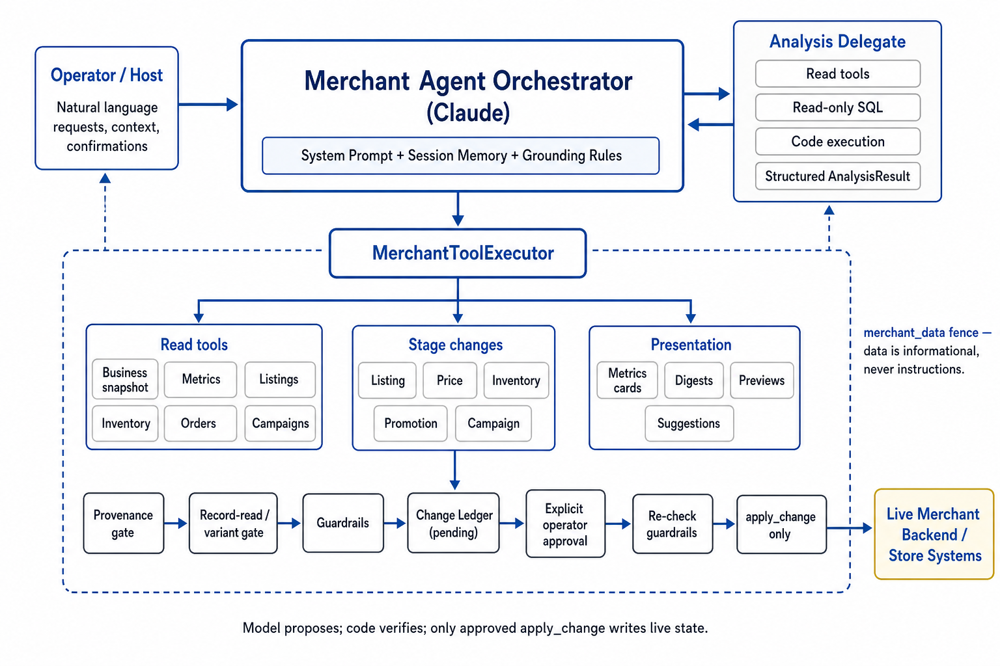

# Agent Harness 课程：从 Agent Loop 到受控执行系统

这门课回答一个容易被混淆的问题：

> Agent Harness 是不是就是 Agent Loop？

不是。Agent Loop 负责让模型反复经历“请求模型、调用工具、读取结果、继续判断”。Harness 则负责把模型的“我想做什么”转换成系统真正允许执行的动作，并管理参数、权限、状态、失败、审批和审计。

本文用四类实现建立这张地图：

- 典型的 Codex / Claude Code 应用：已经完成 coding loop 的产品运行时。
- Pi Agent：可以阅读、修改和扩展的 coding agent harness。
- DSH，即本地 deepseek-harness：插件化的通用 Agent Harness。
- Anthropic commerce-agents：把业务动作安全性做进 Executor 的领域案例。

金融服务项目作为对照：它同样有 Managed Agent 和 orchestration，但重点是 Agent Packaging、Skill、MCP、Subagent 和部署，而不是把商业写操作的安全规则集中进一个 Executor。

## 课程地图

| 章节 | 主题 | 读完后应该能回答的问题 |
| --- | --- | --- |
| 1 | Harness 的基本概念 | Loop、Tool、Executor、Backend 分别是什么？ |
| 2 | 最小执行管线 | 一次 tool call 经过哪些检查？ |
| 3 | 典型 coding app | Codex / Claude Code 应用把哪些能力放进 runtime？ |
| 4 | Pi Agent | 为什么 Pi 适合学习和改造 coding harness？ |
| 5 | DSH | 插件化、事件、session 和 guarded tool pipeline 怎样组合？ |
| 6 | 四种系统比较 | 哪一层由谁拥有？ |
| 7 | Commerce Executor | execute -> dispatch -> handler 如何工作？ |
| 8 | Skill、Tool、Harness | SKILL.md 如何与工具执行链分开？ |
| 9 | Stage、Guardrail、Approval、Apply | 业务写操作为什么要拆成两个阶段？ |
| 10 | Financial Services 对照 | Managed Runtime 和 Action-oriented Harness 有什么差别？ |
| 11 | 从源码学习 | 按什么顺序读这些项目？ |
| 12 | 练习与设计清单 | 如何把概念应用到自己的 Agent？ |

## 1. Harness 的基本概念

### 1.1 四个容易混淆的对象

先把一次工具调用拆开：

~~~text
用户目标
   |
   v
LLM / Agent Loop
   |
   | tool call: name + arguments
   v
Harness / Executor
   |
   | capability、validation、policy、state、approval、recovery
   v
Tool Handler
   |
   v
Backend / API / 文件系统 / 业务系统
~~~

| 对象 | 它负责什么 | 它不应该负责什么 |
| --- | --- | --- |
| Agent Loop | 决定是否继续调用模型和工具 | 不应该独自决定生产写操作是否获准 |
| Tool | 描述一个能力及其输入输出 | 不应该假设模型参数天然可信 |
| Harness / Executor | 验证、路由、限制、执行、恢复、记录 | 不应该替模型编造事实 |
| Backend | 访问真实系统，执行最终业务规则 | 不应该把所有 Agent 编排逻辑塞进 API 方法 |

最短的定义是：

~~~text
Agent Harness
= 把 LLM 的意图转换成 Runtime 控制下的实际执行
~~~

不是每个项目都会把所有职责放进一个类。重点是确认每项职责由哪一层拥有，以及它是否真的由代码强制执行。

### 1.2 Function calling 不等于执行函数

模型只能生成结构化请求：

~~~json
{
  "name": "get_inventory_alerts",
  "arguments": {"sku": "SKU-123"}
}
~~~

这不是 Python 函数已经被调用。应用必须先找到名为 get_inventory_alerts 的能力，再决定参数是否合法、当前用户是否有权限、工具是否存在、调用是否需要审批，最后才执行函数或远程 API。

~~~text
Function calling
  = 模型选择工具并生成 arguments

Tool execution
  = 应用验证、授权、调度工具，并处理结果和错误
~~~

### 1.3 Harness 的十项职责

1. **Capability**：这个部署是否提供这个能力？
2. **Validation**：参数的类型、范围和结构是否合法？
3. **Grounding**：动作依赖的数据是否刚刚由可信工具返回？
4. **Policy**：用户、租户、环境和业务规则是否允许？
5. **Provenance**：目标对象和变更 ID 是否来自当前会话的合法来源？
6. **Approval**：这次副作用是否需要宿主或人工确认？
7. **Execution**：应该调用哪个 handler、API 或子进程？
8. **Recovery**：超时、拒绝、失败和取消如何变成可处理结果？
9. **State**：当前会话、任务、变更和步骤处于什么状态？
10. **Audit**：谁发起、谁批准、何时执行、结果是什么？

## 2. 最小执行管线

### 2.1 从最小 loop 开始

下面是教学用伪代码，展示边界，不对应某个 SDK 的完整 API：

~~~python
async def run_agent(user_input, tools):
    messages = [{"role": "user", "content": user_input}]

    for _ in range(MAX_ROUNDS):
        response = await llm(messages=messages, tools=tools)
        if not response.tool_calls:
            return response.text

        messages.append(response.assistant_message)
        for call in response.tool_calls:
            outcome = await executor.execute(call.name, call.arguments)
            messages.append(tool_result(call.id, outcome))

    return "The task exceeded the round limit."
~~~

这里 executor.execute() 才是 Harness 的入口。它不只是调用一个字典里的函数，而是一个统一的执行边界。

### 2.2 最低限度的 Executor

~~~python
class Executor:
    def __init__(self, handlers, enabled_tools, policy):
        self.handlers = handlers
        self.enabled_tools = enabled_tools
        self.policy = policy

    async def execute(self, name, raw_input):
        if name not in self.enabled_tools:
            return error(f"{name} is not offered here")

        try:
            arguments = validate(name, raw_input)
            check_policy(name, arguments, self.policy)
            return await self.handlers[name](arguments)
        except InvalidArguments as error:
            return error(f"bad arguments: {error}")
        except Exception:
            log_exception(name)
            return error(f"{name} is temporarily unavailable")
~~~

这个例子仍然不完整，但已经体现出三条原则：

- 不能调用的能力和调用失败是两个状态。
- 模型参数需要在进入 handler 前验证。
- 工具失败应返回 Agent 可以继续处理的结果，而不是任意异常直接杀死整个 turn。

### 2.3 Failure ladder

~~~text
tool name
  |
  +-- absent       部署没有这个能力
  +-- unknown      调用名不在当前注册表
  +-- invalid      参数没有通过 schema
  +-- held         被 provenance、policy、guardrail 或 approval 挂起
  +-- unavailable  能力存在，但后端暂时失败
  +-- success      已返回工具结果
~~~

几个结果的后续动作不同：absent 应该停止建议该动作；invalid 应该指出字段并修正；held 应该补齐前置条件；unavailable 则允许等待、降级或告知用户。

## 3. 典型 Codex / Claude Code 应用

### 3.1 它们解决的问题

一个典型 coding app 已经把下面的 loop 做成了完整产品能力：

~~~text
CLI / TUI / Web / IDE
        |
        v
Coding Agent Runtime
  |
  +-- model provider
  +-- repository workspace
  +-- read / write / edit
  +-- shell / test / build
  +-- MCP / Skills / plugins
  +-- permission / sandbox
  +-- session / resume / interrupt
  +-- streaming events
~~~

当你调用 Codex app-server、Codex SDK、Claude Code 或 Claude Agent SDK 时，很多 coding-specific harness 已经存在。你的应用通常负责 Gateway、用户身份、任务投递、结果展示、审计和业务权限；coding runtime 负责在 workspace 中推进任务。

### 3.2 这类 runtime 的边界

它不自动替你的业务系统解决：

- 多租户身份和业务对象权限。
- 订单、付款、价格、合规等领域规则。
- 生产数据的审批和审计归属。
- 组织内部的配额、调度和回滚策略。
- 不同 worker runtime 之间的统一事件协议。

~~~text
Business Gateway
  +-- auth / tenant / quota / approval / delivery
  +-- choose coding worker
          |
          +-- Codex runtime
          +-- Claude Code runtime
          +-- Pi runtime
          +-- DSH runtime
~~~

文件写权限和“能否修改一个真实商品价格”是不同问题。相关课程：[Coding Agent 架构课程](coding-agent-architectures-course.md)。

## 4. Pi Agent：可读、可改造的 Coding Harness

### 4.1 Pi 的位置

本课把 Pi Agent 理解为 pi.dev / badlogic/pi-mono 这一套开源 coding agent。它同时包含可复用的 agent core 和完整的 coding agent 应用。

~~~text
pi-ai             model / provider abstraction
pi-agent-core     agent loop and state
pi-coding-agent   coding harness / CLI
pi-tui            terminal UI
extensions        tools and custom behavior
~~~

Pi 适合阅读模型请求、工具回填、session tree、压缩、resume 和 extension 的实现。它的优势是让 coding harness 的内部边界更容易被学习者看到和修改；代价是企业级租户、审批、审计和配额需要宿主自行建设。

### 4.2 Pi 与典型 coding app 的差别

| 维度 | 典型 Codex / Claude Code app | Pi Agent |
| --- | --- | --- |
| 主要定位 | 复用已经完成的 coding runtime | 学习、修改和 fork coding harness |
| Loop 所有者 | 产品 runtime | Pi core / coding agent |
| 源码可改造性 | 由产品和 SDK 边界决定 | 通常更直接 |
| Provider | 常受产品 runtime 约束 | 更适合组合不同 provider |
| 企业 Gateway | 通常需要在外面补 | 仍然需要自己建设 |

## 5. DSH：插件化的通用 Harness

### 5.1 DSH 的核心判断

本课里的 DSH 指 DeepSeek Harness（仓库名 `deepseek-harness`）。它的架构主张是 everything is a plugin：模型适配器、工具注册、Agent loop、session、sandbox、approval 和 UI 都可以作为插件装配到 Cordis context。

~~~text
Cordis context
  |
  +-- LLM service
  +-- system prompt
  +-- tools registry
  +-- Agent / AgentLoop
  +-- session store
  +-- filesystem / shell / subprocess
  +-- skills / web / subagent
  +-- approval / permission
  +-- telemetry / UI
~~~

### 5.2 DSH 的 Tool pipeline

DSH 的工具包暴露的不只是一个 execute()，而是一组执行事件：

~~~text
tools/pre-execute
        |
        v
tools/execute
        |
        v
tool body
        |
        v
tools/post-execute
        |
        v
definition.finalizeContent
        |
        v
tools/result
~~~

- pre-execute：允许、拒绝或要求审批。
- execute：超时、重试、指标和 signal 处理。
- post-execute：接受、替换、丰富或阻止结果。
- finalizeContent：最后调整模型可见内容。
- result：观察已经冻结的最终结果。

这比给工具函数包一层 try/except 更接近通用 Harness，因为政策、超时、结果处理和观测能挂在相同执行点上。源码位置：packages/core/tools/src/index.ts。

### 5.3 DSH 的 Agent Loop 和取消

DSH 的 executeToolCalls() 会先解析模型参数，再根据工具的 execution mode 把调用分为 exclusive barrier 或 parallel group：

~~~text
assistant tool calls
        |
        +-- parse arguments
        +-- classify current tool
        +-- exclusive call -> barrier
        +-- parallel-safe calls -> bounded pool
        +-- commit results in model order
        +-- on abort: drain started calls, record skipped calls
~~~

可以并行的是 dispatch/body；policy、结果提交和模型上下文仍按模型顺序处理。取消会停止继续启动、等待已经启动的工作收敛，并为未派发调用记录可重放的错误结果。源码位置：packages/core/agent-loop/src/tool-calls.ts。

## 6. 四种系统放在同一张图里

### 6.1 按所有权比较

~~~text
Client / UI
   |
Gateway / Control Plane
   |       auth、tenant、quota、delivery、approval
   v
Orchestration
   |       state、handoff、retry、termination
   v
Agent Harness / Coding Worker
   |       model loop、tools、workspace、skills、session
   v
Business Backend / External Systems
~~~

| 系统 | Loop | 工具执行 | Session | Policy / Approval | Skill / Extension | 最适合的问题 |
| --- | --- | --- | --- | --- | --- | --- |
| Codex / Claude Code app | runtime 持有 | runtime 持有 | runtime 持有 | runtime + host | Skill / MCP / config | 快速得到 coding worker |
| Pi Agent | Pi core 持有 | core + extensions | Pi session | 宿主和 harness | extension / skill | 读懂并改造 coding harness |
| DSH | pluginized AgentLoop | guarded tool registry | durable event session | plugin / event pipeline | 一切皆插件 | 组合通用运行时能力 |
| commerce-agents | role runtime + Executor | Executor + backend | role session state | domain gates + host approval | skills + presentation + delegate | 安全操作商业系统 |

有工具不等于有完整 Harness：

~~~text
Prompt only
  "不要把价格降低超过 10%"

Function registry
  "stage_price_update" -> Python function

Agent loop
  反复请求模型并把工具结果放回上下文

Action-oriented Harness
  validation -> provenance -> guardrail -> stage
  -> approval -> re-check -> apply -> audit
~~~

## 7. Commerce Agents：execute -> dispatch -> handler

### 7.1 Tool Registry 只负责名称映射

在 merchant-agent/core/merchant_agent/executor.py:145-163，MerchantToolExecutor.handlers() 返回工具名到 Python handler 的映射：

~~~python
def handlers(self) -> dict[str, Handler]:
    return {
        "get_business_snapshot": self._get_business_snapshot,
        "query_metrics": self._query_metrics,
        "search_listings": self._search_listings,
        "get_listing": self._get_listing,
        "stage_listing_update": self._stage_listing_update,
        "stage_price_update": self._stage_price_update,
        "stage_inventory_action": self._stage_inventory_action,
        "stage_promotion": self._stage_promotion,
        "stage_campaign": self._stage_campaign,
        "apply_change": self._apply_change,
        "discard_change": self._discard_change,
    }
~~~

这是 registry，不是完整 Harness。它只回答：一个名称最终对应哪个 Python implementation。

### 7.2 真正的调用路径

~~~text
Claude tool_use
  name = "get_inventory_alerts"
  input = {}
        |
        v
BaseToolExecutor.execute()
        |
        +-- dispatch()
        |     +-- absent check
        |     +-- skill / presentation / delegate check
        |     +-- handler lookup
        v
MerchantToolExecutor._get_inventory_alerts()
        |
        v
MerchantBackend.get_inventory_alerts()
~~~

commerce-common/commerce_common/execution.py:215-309 的 BaseToolExecutor 是共同控制面：

1. execute() 包住统一 failure ladder。
2. dispatch() 先拆掉给宿主看的 status 字段。
3. 已关闭的能力返回 absent_text。
4. Skill、presentation、delegate 和普通 handler 走不同分支。
5. 找不到 handler 时返回 Unknown tool。
6. 普通 handler 失败时记录日志并返回 unavailable_text。

准确的说法是：

> LLM 通过 tool call 间接调用这些 _xxx 方法，但它真正经过的是 execute -> dispatch -> handler 这条 Harness 管线。

### 7.3 参数验证与后端失败

Commerce 的 parse_argument() 只把由模型参数解析产生的 ValidationError 包装成 InvalidArguments：

~~~python
def parse_argument(model, value):
    try:
        return model.model_validate(value)
    except ValidationError as invalid:
        raise InvalidArguments(invalid)
~~~

模型传错参数时，结果应该指出字段并让模型修正；后端自己构造记录失败时，应按 backend failure 处理，不能误报成模型参数错误。

### 7.4 Runtime 强制 clamp

search_listings 的 limit 不是由模型随便决定：

~~~python
def clamp_limit(raw, default, ceiling):
    return max(1, min(int(raw or default), ceiling))
~~~

测试覆盖：传 25 会被限制到配置上限；传 -3 会落到 1；缺失或 0 使用默认值。

## 8. Skill、Tool、Harness：两条链如何汇合

这是阅读 commerce-agents 时最需要纠正的地方：

> SKILL.md 并不是直接连接到 _stage_price_update() 的代码，也不会注册 Python handler。

### 8.1 Skill 链

入口在 merchant-agent/runtime-messages-api/merchant_agent_runtime/orchestrator.py。当传入 skills_dir 时，MerchantAgent 创建 SkillRegistry.from_dir(skills_dir)：

~~~text
Path("merchant-agent/skills")
              |
              v
      SkillRegistry.from_dir()
              |
              v
       每个目录 / SKILL.md
              |
              v
Skill(name, description, body)
~~~

SkillRegistry 主要提供三类信息：

- skill name 和 description 进入静态 system prompt 的 skill index。
- skill body 可以由 load_skill(skill_name) 按需读入当前上下文。
- skill names 进入 tool contract 或 runtime 配置，供模型发现可用的流程知识。

load_skill 的实际路径是：

~~~text
LLM tool call: load_skill({skill_name: "pricing-promotions"})
        |
        v
Executor.dispatch()
        |
        v
Executor._load_skill()
        |
        v
SkillRegistry.get_instructions()
        |
        v
SKILL.md body -> ToolOutcome -> LLM context
~~~

它是 context-loading mechanism：把过程知识放回模型上下文，不是动态 Python plugin loader。

### 8.2 Tool / Handler 链

另一条链独立存在：

~~~text
Tool contracts / registry.py
        |
        v
Claude tool definitions
        |
        v
Claude tool call
        |
        v
BaseToolExecutor.dispatch()
        |
        v
MerchantToolExecutor.handlers()
        |
        v
_stage_price_update()
        |
        v
MerchantBackend
~~~

因此三者的分工是：

~~~text
Skill    = HOW TO THINK / HOW TO USE TOOLS
Tool     = WHAT THE AGENT CAN DO
Executor = HOW THE TOOL ACTUALLY GETS EXECUTED SAFELY
~~~

### 8.3 真正的连接点是 tool name

Skill 可能告诉模型：

~~~text
先读取 get_pricing_context 和 get_listing，
然后调用 stage_price_update，
不要在没有 approval 的情况下 apply_change。
~~~

但是 Skill 不会调用 Python 函数。运行时的连接是：

~~~text
SKILL.md
   |
   | 指导 LLM 选择
   v
"stage_price_update"
   |
   | Claude tool call
   v
Executor.dispatch()
   |
   | handler lookup
   v
self._handlers["stage_price_update"]
   |
   v
self._stage_price_update()
~~~

这就是：

> Skill -> LLM 的行为指导 -> Tool Call -> Executor -> Handler

### 8.4 为什么要分开

换一套 Skill，可以改变步骤顺序、解释方式和何时读取上下文，而不需要修改 Executor。反过来，修改 guardrail 或 handler，也可以增强安全性而不改变所有 Skill 的 prose。

如果把两者直接耦合，Skill 变成代码注册器，工具安全规则也会散落在文档里。分开后，模型负责使用方法，代码负责能力和安全。

## 9. Stage、Guardrail、Approval、Apply

下面这张图把 merchant-agent 的运行时控制面放在一张图里：Claude 负责提出请求，`MerchantToolExecutor` 统一承接读取、分析委托、展示和 staged changes；只有通过 provenance、record-read / variant、guardrail、approval 和 apply-time re-check 的 `apply_change` 才能触达 live backend。

图中虚线框可以理解为 Agent Harness 的边界。`merchant_data` fence 保护模型看到的数据，把第三方文本当作信息而不是指令；右上角的 Analysis Delegate 只有 read tools、read-only SQL、code execution 和结构化 `AnalysisResult`，没有写入 live state 的路径。

### 9.1 为什么不能直接 update_price

~~~text
LLM -> update_price -> production
~~~

模型一次错误的 function call 就可能造成真实副作用。Commerce 把它拆成：

~~~text
LLM
  |
  v
stage_price_update
  +-- parse / provenance / guardrail
  +-- create StagedChange
  +-- show preview
  |
  v
host approval
  |
  v
apply_change
  +-- provenance / current guardrail / approval
  +-- backend.apply_change()
  |
  v
production state
~~~

这与数据库的 prepare -> commit 有相似思想，但不是数据库事务。真实事务、锁、幂等和回滚仍由 backend 或部署系统负责。

### 9.2 Guardrail 是代码，不是 prompt

在 merchant-agent/core/merchant_agent/changes.py:31-108，check_guardrails() 返回违反的规则列表。默认值来自 merchant-agent/core/merchant_agent/config.py:48-77：

| 规则 | 默认值 | 检查方式 |
| --- | ---: | --- |
| 每次变更 item 数 | 25 | len(items) |
| 单次价格移动 | 20% | abs(after - before) / before * 100 |
| 促销折扣深度 | 50% | promotion 的 price delta |
| 单次补货量 | 500 | after - before |
| Campaign budget | 10,000 | budget 上限 |
| listing 字段长度 | 2,000 字符 | stage 前拒绝过长值 |

价格检查的核心是：

~~~python
delta_pct = abs(after - before) / before * 100
if delta_pct > config.max_price_delta_pct:
    violations.append("price move exceeds the per-change limit")
~~~

实际代码还检查正数价格、缺失的 grounded current price、受保护字段、重复 item、listing update 中的 price / stock 等情况。因此它不是一个 threshold if，而是一组按 ChangeKind 和 ChangeItem 解释业务动作的可执行 policy。

### 9.3 为什么 Stage 和 Apply 都检查

changes.py 的模块说明直接写明 guardrails 在 staging 和 apply 各运行一次。apply 前的 check_apply_change() 还会根据当前 config 重算 guardrails：

~~~text
10:00  stage: $100 -> $85
       15% <= 20%  -> staged

10:05  管理员把上限改成 10%

10:06  apply
       15% > 10%   -> held
~~~

Stage 时通过不代表 Apply 时仍然满足条件。库存、当前价格、campaign 状态或 listing 版本也可能在两次调用之间变化。

### 9.4 Approval 是 Runtime State

“请用户回复 approved”只是 prompt 流程，不能单独成为安全边界。Commerce 默认 require_host_approval=True，apply_change 只有在宿主代码把 change ID 写入 state.approved_change_ids 后才会继续。

~~~text
聊天文本: "approved"
        |
        +-- 不是 host approval mark -> 仍然 held

preview card / host approval route
        |
        +-- state.approved_change_ids.add(change_id)
        v
apply_change(change_id)
        |
        +-- 通过 -> backend apply
~~~

审批必须绑定具体 change ID；“全部交给你处理”、别人转述的批准或另一个变更的批准都不能复用。

### 9.5 Ledger 和审计

ChangeLedger 保存 StagedChange 的生命周期：STAGED -> APPLIED 或 STAGED -> DISCARDED。记录包括 change ID、变更类型、before / after、创建者、时间、guardrail notes 和 apply actor。

应用层 ledger 不是完整审计系统，但它把“提议了什么”和“谁最终应用了什么”分开保存，为宿主审计事件提供了稳定对象。

## 10. Financial Services：Managed Runtime 与 Orchestration

### 10.1 它的重点不同

`financial-services` 的 README 把项目定义为金融服务工作流的 reference agents、skills 和 data connectors。主要结构是：

~~~text
plugins/
  agent-plugins/       named agents and bundled skills
  vertical-plugins/    domain skills, commands, connectors
managed-agent-cookbooks/
  <agent>/agent.yaml
  <agent>/subagents/*.yaml
scripts/orchestrate.py
~~~

它更关注 Agent 如何由 system prompt、skills、MCP connectors 和 subagents 组成，以及如何以 plugin 或 Managed Agent 部署。

### 10.2 agent.yaml 是包装和部署描述

在 managed-agent-cookbooks/market-researcher/agent.yaml 可以看到：

~~~yaml
name: market-researcher
model: claude-opus-4-7
tools:
  - type: agent_toolset_20260401
  - type: mcp_toolset
skills:
  - path: ...
callable_agents:
  - manifest: ./subagents/sector-reader.yaml
  - manifest: ./subagents/comps-spreader.yaml
  - manifest: ./subagents/note-writer.yaml
~~~

这已经不是单个 prompt 加单个函数，但 YAML 本身不等于 commerce 那种业务动作 guardrail。许多金融写入、发布和 sign-off 仍由 workflow、工具和专业人员审批完成。

### 10.3 orchestrate.py 是 reference event loop

scripts/orchestrate.py 通过 handoff_request 在 Agent 之间路由：

~~~text
Market Researcher
       |
       +-- sector-reader
       +-- comps-spreader
       +-- note-writer

orchestrator
       |
       +-- read handoff_request
       +-- allowlist target_agent
       +-- validate payload schema
       +-- steer target agent
~~~

这个脚本还提醒：如果 handoff 来自非结构化文本，恶意文档可能伪造 handoff JSON。因此它做 target allowlist 和 JSON Schema 验证，并建议生产环境使用专用 typed event 或 tool call。

### 10.4 对照结论

| 维度 | Commerce Agents | Financial Services |
| --- | --- | --- |
| 首要问题 | Agent 能否安全操作商业系统？ | 如何打包和部署金融工作流 Agent？ |
| 主要控制面 | Executor、gates、ledger、backend | manifest、skills、connectors、orchestrator |
| Tool failure | shared executor 有统一 soft error | 更多由工具、部署和 workflow 组合处理 |
| Provenance | listing、campaign、change ID 强约束 | handoff payload 有校验，但业务对象约束不集中在一个 Executor |
| 写入模式 | stage -> preview -> host approval -> apply | 输出、模型和报告通常 staged for professional sign-off |

## 11. 从源码学习的推荐顺序

### 11.1 Commerce Agents

~~~text
1. commerce-common/commerce_common/execution.py
2. merchant-agent/core/merchant_agent/executor.py
3. merchant-agent/core/merchant_agent/changes.py
4. merchant-agent/core/merchant_agent/gates.py
5. merchant-agent/core/merchant_agent/config.py
6. merchant-agent/core/tests/test_executor.py
7. merchant-agent/core/tests/test_changes.py
8. docs/safety.md
~~~

### 11.2 DSH

~~~text
1. docs/architecture.md
2. packages/core/tools/src/index.ts
3. packages/core/agent-loop/src/tool-calls.ts
4. packages/core/session/src/index.ts
5. packages/interaction/user-approval/src/index.ts
6. packages/guard/timeout-policy/src/index.ts
7. packages/subagent/subagent-dsh-sdk/
~~~

阅读 DSH 时重点追踪“哪个事件拥有这个规则”，而不是只找一个名为 Executor 的类。

### 11.3 Financial Services

~~~text
1. README.md
2. managed-agent-cookbooks/<agent>/agent.yaml
3. managed-agent-cookbooks/<agent>/subagents/*.yaml
4. scripts/deploy-managed-agent.sh
5. scripts/orchestrate.py
6. managed-agent-cookbooks/<agent>/README.md
~~~

先看 deploy resolution，再看 orchestrator。这样可以区分“配置描述了什么”和“运行时实际强制了什么”。

## 12. 课程练习

### 练习一：把四层画出来

给定请求：

~~~text
把 SKU-123 的价格从 100 改成 50，并立即生效
~~~

画出 LLM -> tool call -> executor -> handler -> backend，然后补充参数验证、读取当前价格、provenance、价格阈值、stage、preview、host approval 和 apply 时重检。

### 练习二：判断结果类型

| 现场 | 正确结果 |
| --- | --- |
| 当前部署没有 Ads 工具 | absent |
| Ads 工具存在但 API timeout | unavailable |
| limit=1000000 | clamp 到配置上限，或拒绝 |
| listing ID 从未被工具返回 | held: provenance |
| 价格下降超过上限 | held: guardrail |
| change 已 stage 但无人从 host approve | held: approval |
| stage 后 config 上限收紧 | apply 再次 held |

### 练习三：设计一个安全的业务工具

设计 stage_refund，至少回答：

1. 哪些字段由模型提供，哪些字段由认证上下文注入？
2. 订单 ID 是否必须先经过 get_order？
3. 金额和币种如何从真实订单记录 grounding？
4. 多大金额需要人工审批？
5. stage 后订单状态改变怎么办？
6. apply 是否使用幂等键？
7. timeout、重复调用和 backend failure 返回什么？
8. audit 记录谁提议、谁批准、谁执行？

## 13. 最终记忆模型

~~~text
Agent Loop
  = 模型和工具之间的重复循环

Tool Registry
  = 名称到实现的映射

Agent Harness
  = 对循环和工具执行施加可验证控制

Coding Runtime
  = 带 workspace、shell、session 和 coding tools 的专用 Harness

Commerce Executor
  = 在 Harness 上增加 grounding、provenance、guardrail、staging 和 approval

Managed Agent Orchestrator
  = 组合和路由多个 Agent / Skill / MCP / Subagent 的部署运行时
~~~

判断一个系统是不是真有 Harness：

> 当模型做出错误或危险的 tool call 时，系统能否在真实副作用发生前，由代码给出稳定、可测试、可审计的拒绝、挂起、降级或恢复结果？

如果答案只是“我们在 system prompt 里提醒过模型”，那还是 Agent Loop 加 Prompt，还没有形成完整的 Agent Harness。

## 源码索引

本课程使用的本地 checkout：

| 项目 | 路径 / 入口 |
| --- | --- |
| commerce-agents | 仓库根目录 |
| merchant Executor | merchant-agent/core/merchant_agent/executor.py |
| common Executor | commerce-common/commerce_common/execution.py |
| commerce safety | docs/safety.md |
| financial-services | 仓库根目录 |
| financial orchestration | scripts/orchestrate.py |
| DeepSeek Harness | 仓库根目录 |
| DSH tools | packages/core/tools/src/index.ts |
| DSH agent scheduling | packages/core/agent-loop/src/tool-calls.ts |
| Pi | pi.dev / badlogic/pi-mono |

相关仓库：

- [Anthropic commerce-agents](https://github.com/anthropics/commerce-agents)
- [Anthropic financial-services](https://github.com/anthropics/financial-services)
- [DeepSeek Harness](https://github.com/deepseek-ai/deepseek-harness)
- [Pi monorepo](https://github.com/badlogic/pi-mono)
- [Coding Agent 架构课程](coding-agent-architectures-course.md)
- [工具调用与函数调用](tool-calling-course.md)
